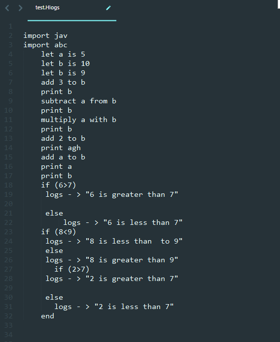
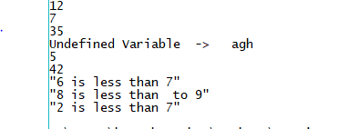

# SC_project
Too Simple ANTLR project using Listener 

## Getting started
(Keeping things easy)!!
Follow the  to set up the project

After that move to the the project folder containing the project files via `CMD` or `Terminal` run the command

```

> java Main file_name

```
to get the output of the source file.

## Features

- Decalre variable
- Assign value to variable
- Basic arithmetic operations
  - Addition
  - Subtraction
  - Multiplication
- Print the value of variable
- If_else condition on (less than or greater than Operator(limited to this only) with numbers only)
  - print string in the condiion.
  
## Syntax
 
 The syntax for the source is as
 
  
 
 **Output**
 

#####  _Grammer is described in `Hlogs.g4`_
 
 ## Resources
 
 The resources utilized for this and understandings are
 - [A mega guide to Antlr](https://tomassetti.me/antlr-mega-tutorial/)
 - [Antlr 4 - Listener vs Visitor](http://jakubdziworski.github.io/java/2016/04/01/antlr_visitor_vs_listener.html)
 - [How to use visitors ANTLR](https://stackoverflow.com/questions/19472986/how-to-use-antlr4-visitor)
 
 #### Use of Listeners is not encouraged! Vistors are highly recommended.
 It's just what you can implement in less time(mini tasks).....
 
 
